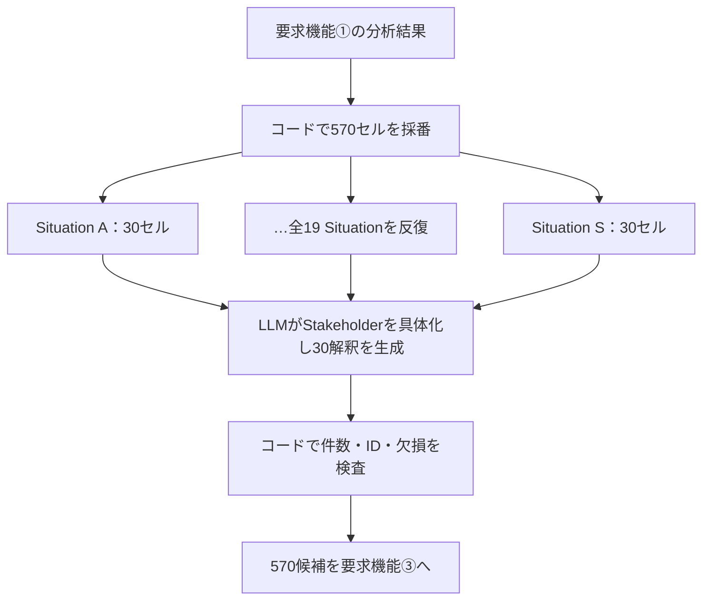

# 要求機能②「文脈発想フェーズ」再設計報告書 v2

作成日：2026-08-27  
推奨構成：**Situation単位で処理する全直積方式（Programmed Full Cartesian Expansion）**

## 0. 今回の訂正

前版で推奨した「被覆制約付き二段階探索」と24案制御は撤回する。前版は、8/12 MTGで「全直積以外も検討してよい」とされた論点を、合意済みの「要求機能②では全直積で発散する」より優先してしまっていた。

正しい設計課題は、全直積をやめることではない。

> **全直積を維持したまま、各軸の要素数・具体化粒度・実行基盤を調整し、現行ツールと同程度の500〜700件へ収めること。**

また、前版の`Req①`、`Req③`はそれぞれ**要求機能①**、**要求機能③**の略記である。意味は同じだが、報告書では初出から正式名称を使い、略記による混乱を避ける。

## 1. 修正後の前提

### 1.1 維持する事項

- 要求機能①：対象特許の技術・背景・課題・既存用途を分析する。
- 要求機能②：新しいBtoB文脈・意味的価値を広く発散する。
- 要求機能③：新規性・有用性・事業性・技術適合性・意外性等から評価する。
- 要求機能②では、`Stakeholder × Situation × Context`の全直積を発散する。
- 技術から遠い産業や、一見成立しにくい組合せも要求機能②では削らない。
- StakeholderはBtoB文脈発想の中心概念として維持する。
- 500〜700件程度の発散は許容範囲とする。

### 1.2 前版から撤回する事項

- 19産業から距離quotaで12枝だけを選ぶこと。
- 12枝から24候補だけを残すこと。
- Contextを独立軸から外すこと。
- StakeholderをActor Functionへ名称変更すること。
- 重複候補を要求機能②で統合・削除すること。

## 2. 軸の再構成

### 2.1 Stakeholder：9から5へ統合

Stakeholderは削除せず、従来の9 Stageと横断Stakeholderを次の5群へ統合する。

| ID | Stakeholder | 旧分類との対応 |
|---|---|---|
| S1 | 技術提供・事業化主体 | 1 技術を生み出す〜3 製品・システムにする |
| S2 | 導入・評価・意思決定主体 | 4 事業として導入する＋技術評価者 |
| S3 | 現場運用・維持主体 | 5 現場で使う・運用する＋6 維持・支援する |
| S4 | 顧客・価値受領主体 | 7 顧客へ価値を届ける＋8 最終価値を受け取る |
| S5 | 制度・社会影響主体 | 9 社会への影響＋規制・認証・監査・標準化 |

この5群は、BtoBで重要な「技術供給」「導入評価」「現場」「顧客・受益」「制度・社会」を分離しつつ、9 Stageの重複を減らす暫定案である。詳細は`01_stakeholder_framework.csv`に記載する。

前版のActorはStakeholderの言い換えとして使っていた。しかし、概念が別に見えるため使用をやめる。今後は次の階層へ統一する。

`Stakeholder Group > Organization Archetype > Role`

### 2.2 Situation：19大分類を維持

Situationは日本標準産業分類2023年改定の19大分類を探索アンカーとして使う。遠い産業をAI判断で削らないため、19分類は全件処理する。

各分類名は最終候補の粒度ではない。AIは「漁業」等の大分類を、具体的な現場・業務・状態へ詳細化する。前版の8横断overlayは、今回の既定直積には含めない。

### 2.3 Context：6つの上位文脈へ統合

前版の12 Meaning Lensを、そのまま12軸要素として使うと`5 × 19 × 12 = 1,140`件になる。そこで意味領域を6上位Contextへ統合し、元の12 Lensは各Context内部の下位観点として保持する。

| ID | Context | 主な下位観点 |
|---|---|---|
| C1 | 証拠・信頼 | 来歴、真正性、保証、監査可能性 |
| C2 | 可視化・判断 | 共通言語、判断分散、非専門家判断 |
| C3 | 人・能力 | 能力拡張、安全、尊厳、技能継承 |
| C4 | 継続・適応 | レジリエンス、異常時継続、将来対応 |
| C5 | 関係・共創 | 協調、相互運用、責任分界、共同学習 |
| C6 | 社会・資源・継承 | 循環、正当性、地域価値、組織の記憶 |

#### ContextとMeaning Lensの関係

両者は別の独立軸ではない。前版での説明が不十分だった。

- **Context**：全直積表に置くカテゴリ値。
- **Meaning Lens**：そのContextから意味を発想するための問い・操作プロンプト。

例えば、Contextが「証拠・信頼」なら、Meaning Lensは「この技術によって、何が検証可能な証拠となり、誰が誰を信頼できるようになるか」という問いである。つまり、実装上はContextの各行に`lens_prompt`を持たせる。ContextとMeaning Lensをさらに掛け合わせるわけではない。

## 3. 候補数

既定候補数は次の通りである。

`5 Stakeholder × 19 Situation × 6 Context = 570候補`

570件は、現行ツールが扱っている500〜700件の発散規模に収まる。各セルからInterpretationを1件生成する。複数案が必要な場合は、軸を増やさず別runとして570件を再生成する。

## 4. アーキテクチャ案の再比較

### 案A：粗粒度3軸の一括全直積

プログラムで570セルを作り、LLMが各セルを独立に具体化する。

- 全直積：維持。
- 固定：Stakeholder 5、Situation 19、Context 6。
- AI：Situation detail、Organization、Role、Interpretationを生成。
- 長所：最も単純で、候補欠落を機械的に検査できる。
- 短所：同一Situation内でOrganizationの表現が揺れやすく、570件をGem単体で一括出力するのは難しい。

### 案B：Situation単位の全直積（推奨）

19 Situationを**選択せず、順番に全件処理**する。各SituationでStakeholder 5群を具体化し、5 Stakeholder × 6 Contextの30セルを全件生成する。

- 全直積：維持。
- Situation–Stakeholder依存：AIによる具体化で反映。
- 組合せの選択：行わない。
- 長所：病院と工場で異なるOrganization/Roleを使いつつ、全セルを保持できる。
- 短所：APIまたは19回の分割実行が必要。

### 案C：前版の被覆制約付き二段階探索

前版の「19産業と8横断overlayを走査し、距離quotaで12枝を選ぶ」は、次の意味だった。

1. 対象特許との距離から19産業を`near / adjacent / far`へ分類する。
2. `near 3 / adjacent 3 / far 4`の計10産業を選ぶ。
3. 8 overlayのプールから2つを選び、対応する産業と組み合わせて`frontier 2`を作る。
4. 合計12枝から各2候補を生成し24候補にする。

overlayは8個すべてを展開するという意味ではなく、「気候適応」「循環経済」「遠隔・自律」等の横断条件から2つを選ぶための候補プールだった。例えば`電気・ガス・水道 × 分散型エネルギー`を1枝と数える。

この方法は距離帯の多様性を保証する一方、12枝以外を削る。したがって、全直積が合意事項である今回の要求機能②には採用しない。

### 案D：固定カテゴリを持たない意味グラフ探索

AIが自由に意味ノードを展開する方式。新規語を作りやすいが、全直積・再現性・欠落検査の要件に合わないため採用しない。

## 5. 比較表の修正

前版の「Gem実装容易性」は、**Gem画面だけで1回に出力する容易性**と、**コード＋Gemini APIでシステム化する容易性**を混同していた。そのため全直積案Aを不当に低く評価していた。

5が最良。

| 観点 | A 一括全直積 | B Situation単位全直積 | C 12枝選択 | D 意味グラフ |
|---|---:|---:|---:|---:|
| 合意済み全直積との整合 | 5 | **5** | 1 | 1 |
| 産業の形式的網羅性 | 5 | **5** | 3 | 2 |
| Situation–Stakeholder依存 | 2 | **5** | 5 | 5 |
| 再現性・欠落監査 | 5 | **5** | 3 | 2 |
| Gem画面だけでの試作容易性 | 2 | **3** | 5 | 3 |
| コード＋Gemini API実装容易性 | **5** | **5** | 3 | 2 |
| 候補数 | 570 | **570** | 24 | 24〜30 |
| 要求機能③への受渡し | 4 | **5** | 5 | 3 |

案AのGem画面評価が低い理由は、570件一括出力の長さと欠落検査がGem単体では扱いにくいからである。一方、コード＋APIでは直積生成が単純であり、むしろ最も実装しやすい。案Bは30件×19 Situationへ分割でき、依存関係も扱えるため推奨する。

## 6. 人間・コード・LLMの担当範囲

| 担当 | 固定・実行する内容 | 行わないこと |
|---|---|---|
| 人間 | 5 Stakeholder、19 Situation、6 Context、出力schemaを定義 | 個別候補の事前選別 |
| コード | 570セルの全直積、Candidate ID、30件分割、結合、件数・欠損検査 | 意味候補の選択・評価 |
| LLM | Situation固有のOrganization/Role、Interpretation、technical bridge、assumptionを生成 | セルの削除・統合・採点 |
| 要求機能③ | 570件の評価、重複判断、詳細化、絞り込み | 要求機能②の発散漏れ補完を前提にしない |

## 7. 出力形式

最小出力は従来案を維持する。

- Candidate ID
- Stakeholder
- Situation
- Context
- Interpretation

要求機能③で検証できるよう、次を追加する。

- Situation Detail
- Organization Archetype
- Role
- Technical Bridge
- Behavior Change
- Assumption
- Evidence Status
- Duplicate Note

Duplicate Noteは重複候補を削除するためではなく、要求機能③で比較しやすくするための注記である。

## 8. 実装構成

### 8.1 Gem画面での試作

GemにはFramework 3ファイルとInstructionを読み込ませ、1回につき1 Situation・30件を生成する。これはプロンプト品質の確認用であり、全570件の本実行は手作業になる。

### 8.2 コード＋Gemini APIでの本実行

1. `build_cartesian_grid.py`で570件の骨格CSVを生成する。
2. `build_situation_batches.py`で19個の30件batchへ分割する。
3. Gemini APIへbatch送信し、構造化JSONで受け取る。
4. Candidate ID集合、各Situation 30件、合計570件、必須列欠損0を検証する。

Gemini APIはJSON Schemaによる構造化出力と、大量の非同期処理向けBatch APIを提供しているため、本方式はGem画面だけに閉じる必要がない。

## 9. 現時点の推奨

推奨は**案B：Situation単位の全直積**である。

理由は次の3点である。

1. 合意済みの全直積を570件で完全に維持する。
2. SituationごとにStakeholderのOrganization/Roleを具体化し、軸間依存を扱える。
3. 直積・分割・検証をコード、意味生成をLLMへ分離できる。

今回減らすのは候補の探索機会ではなく、軸の固定要素数である。遠い産業・弱い組合せ・重複らしい候補も要求機能②では残し、要求機能③で初めて評価・整理する。

## 10. 次に検証する事項

- Stakeholder 5分類が9 Stageの重要な差異を失っていないか。
- Context 6分類が意味の多様性を過度に圧縮していないか。
- 1 Situation 30件の出力で欠落・形式崩れが起こらないか。
- 同一Situation内でOrganization/Roleの整合性が保たれるか。
- 570件の生成時間・API費用・重複率。
- 前ツールの500〜700件と比べて、意外性と意味的価値の質が維持・向上するか。
