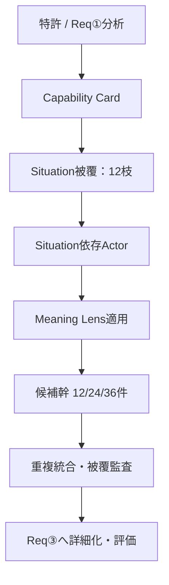

# 要求機能②「文脈発想フェーズ」再設計報告書

版：v1.0 / 作成日：2026-08-23  
推奨構成：**被覆制約付き二段階探索（Coverage-Constrained Progressive Exploration）**

## 0. エグゼクティブサマリー

結論は、`Stakeholder × Situation × Context` の3軸全直積をやめ、次の順序へ置き換えることである。

推奨する既定値は、12のSituation枝に各2候補を生成する24候補である。12枝は `near 3 / adjacent 3 / far 4 / frontier 2` を固定配分し、意外性を確率任せにしない。Stakeholderは9段階の固定Value Delivery Chainではなく、5つのActor Functionだけを人間が固定し、組織類型をSituationに依存してAIが作る。RoleはReq②で全展開せず、Req③で選択候補にのみ付与する。

Contextは独立した第3軸から外す。代わりに、SituationとActorの間の緊張を見つけた後で使う12のMeaning Lensとして実装する。これにより、Contextを全候補へ機械的に掛けずに、「誰にとって何の意味がどう変わるか」を候補に必須化できる。

## 1. 調査範囲と判断ラベル

### 1.1 確認したPBL資料

- [PBL-20260812（録音メモ・全文文字起こしを含む）](https://app.notion.com/p/6c999fc26147473bb8b0f29591ec402b)
- [PBL-20260811-要求機能② 3軸設計整理](https://app.notion.com/p/3b90ce595fa081f6a86eee20431732ce)
- [PBL-20260728-todo整理](https://app.notion.com/p/3ab0ce595fa080d0b4aee422ae1235fb)
- [PBL-20260721](https://app.notion.com/p/3a40ce595fa081f2b043ed3048b14ce3)
- [PBL-20260629](https://app.notion.com/p/0e896e0a88714af5b65ca1c13538ccc9)
- [PBL-20260621-個人タスク](https://app.notion.com/p/3860ce595fa080ba84e8c29073894efc)
- [PBL-20260615](https://app.notion.com/p/888ca637afef437490d6d1c34a1d9128)
- 添付PDF 4件、PPTX 1件、Notion/PBL書き出しCSV・PDF

### 1.2 判断ラベル

- **[確定]**：目的・役割分担など、複数資料で一貫している前提。
- **[MTG示唆]**：8/12を中心に出た修正方向。最終決定ではない。
- **[本提案]**：今回の設計判断。プロトタイプで検証すべき仮説。

### 1.3 添付資料から確認したこと

| 添付 | 確認した内容 | 本設計への反映 |
|---|---|---|
| `三菱電機特許の意味的価値創出に向けた問いの設計と学習の進め方_260617.pdf` | BtoBでは複数Stakeholderを問うこと、初期発想で意図的に除外すべき要素を検討すること | 単一persona化を避け、除外でなくquotaで発散を制御 |
| `Confidential_MN_Mitsumishi_NEWSTANDARD.pdf` | OTBの技術シーズから「新しいが関係のある文脈」を問いで発見するプロジェクト目的 | 用途列挙でなくtechnical bridge付き意味仮説を出力 |
| `【マスター】オンボーディングプログラム_感性設計学を応用した意味のイノベーション.pdf` p.78–79 | NS FORCEの6 Group × 4カテゴリと、文脈キーワードは無限で掲載分類は例示であること | 24箱をBtoBへ機械置換せず、12 Lensを暫定採集器として設計 |
| `【マスター】オンボーディングプログラム_インサイトと覚醒ポテンシャル.pdf` | 行動・習慣・思考・文脈・環境のずれからインサイトを捉える考え | 候補生成でActor間TensionをLensより先に置く |
| `PBL_SVDE_学内中間報告1.pptx`（17枚） | OTB、object×context=meaning、空間操作IF、NS FORCEの初期整理 | 既存の分析→文脈→意味の流れを継承。ただしこれは8/11最終スライドではなく、添付内に8/11版は確認できなかった |

添付PPTXに8/11の最終スライドそのものは見当たらなかったため、8/11案の確定内容はNotionページ、8/12での発表内容と文字起こしを主証拠にした。

## 2. STEP 1｜現状整理

### 2.1 合意済みとみなせる事項

1. **[確定]** 要求機能は、①特許分析、②BtoB文脈・意味的価値の発散、③評価・絞り込みに分かれる。
2. **[確定]** Req②では、既存用途に近い合理的候補だけでなく、人が思いつきにくい遠い産業・主体・価値を残す。
3. **[確定]** BtoBでは、買い手、導入者、利用者、受益者、阻害・正当化主体が一致しない。候補は「誰にとって」を持たなければならない。
4. **[確定]** 出力は「医療に使える」のような用途名でなく、技術がもたらす意味・行動変化を自然言語で表す。
5. **[確定]** Req②の出力はReq③が評価できる構造を持つ。
6. **[確定]** 概念設計だけでなく、小さなGemを動かしながら設計課題を発見する。

### 2.2 未決定事項

- Stakeholderを何分類にするか、その分類をValue Chainにするか機能群にするか。
- SituationをJSIC、ニュース、スタートアップ分類のどれにするか、どの粒度まで固定するか。
- Contextを独立軸として残すか、BtoB版カテゴリをどう構築・検証するか。
- Req②でOrganization/Roleまで詳細化するか、Req③へ送るか。
- 全候補数、1回のGem実行単位、再現性と意外性の制御方法。
- Req②とReq③の境界を、詳細化前後のどこに置くか。

### 2.3 8/12で否定・修正された点

- **9 Stageは「誤り」と否定されたのではなく、固定フレームとして細かすぎると修正された。** 3〜5の大枠とAI展開の組合せが示唆された。
- **産業分類は単純削減できない。** 「漁業」のような遠い領域をAIの常識判断で落とすと、目的自体を損なう。
- **3軸は独立と仮定できない。** 病院と工場では存在するStakeholderが違い、Situation→Stakeholderの条件生成が自然である。
- **3軸全直積はGem運用上の正解ではない。** 数百から数千・数万に増え、出力量、トークン、検証負荷、Req③の評価負荷を膨らませる。
- **BtoB Context 24個は未確定。** NS FORCEの24カテゴリは、多数の文脈から整理された可能性があり、BtoB版をAIとの対話だけでトップダウンに決めない。

### 2.4 最大の設計課題

最大課題は、**探索空間を減らすことではなく、計算しない組合せにも探索機会を与える「被覆の保証」を設計すること**である。全直積をやめると、AIが常識的候補だけを選ぶ危険がある。したがって候補数を有限化しつつ、距離、Actor Function、Meaning Lens familyを明示的なquotaで被覆する必要がある。

### 2.5 減らすもの / 減らしてはいけないもの

| 減らすべきもの | 理由 |
|---|---|
| 固定Stakeholderの細かなStage | Situationごとに組織構造が変わり、固定9段階は空欄・重複を生む |
| Organization × Roleの事前全展開 | 候補数を指数的に増やし、Req③でしか必要ない詳細を先取りする |
| 全Contextを全候補へ掛ける処理 | 意味の薄い機械的組合せと重複が増える |
| 同じ意味の産業名違い・表現違い | 見かけの件数だけ増え、評価負荷が上がる |
| Req②での市場性・実現性の採点 | 発散段階で暗黙の足切りを起こす |

| 減らしてはいけないもの | 保持方法 |
|---|---|
| 遠い産業に触れる機会 | JSIC 19を探索母集団として走査し、farを4枝固定 |
| 買い手以外のActor視点 | 5 Actor Functionのbatch被覆を監査 |
| BtoBの意味的価値の多様性 | 4 Lens family・8 Lens以上を被覆 |
| 技術的な説明可能性 | 各候補にtechnical bridgeを必須化 |
| 不確実な仮説 | 削除せずASSUMPTIONとReq③ unknownsへ残す |
| 異常時・引渡し・再販・廃棄等 | wildcard枠を4件以上確保 |

## 3. STEP 2｜アーキテクチャ4案

### 案A：粗粒度3軸直積

固定5 Stakeholder × JSIC 19 Situation × 12 Context/Lens = **1,140組合せ**。Organization 2 × Role 2まで展開すると **4,560件**。

- 人間固定：5分類、19産業、12レンズ。
- AI生成：組合せごとの解釈、Organization、Role。
- 長所：機械的網羅性、再現性、説明の単純さ。
- 短所：意味のない組合せ、軸間依存の無視、Gem出力限界、Req③負荷。

### 案B：Situation起点の条件生成

JSIC 19を起点に、各産業でAIが主要Actor 2群、Meaning Lens 2個を選び **76件（19×2×2）** を生成する。

- 人間固定：JSIC 19、5 Actor Function、12 Lens。
- AI生成：産業内の現場、Organization、適合Actor、Lens、解釈。
- 長所：Situation–Stakeholder依存を扱える。全直積より大幅に軽い。
- 短所：全19産業を毎回深掘りするためまだ重い。遠距離でも形式的な候補が混ざる。

### 案C：被覆制約付き二段階探索（推奨）

19産業と8横断overlayを母集団として一度走査し、距離quotaで12枝を選ぶ。各枝から2つの異なるActor/Lens構成を作り **24件（12×2）** を生成する。

- 人間固定：19アンカー、8 overlay、5 Actor Function、12 Lens、距離・被覆quota、出力schema。
- AI生成：12枝、現場、Organization archetype、Actor関係、Tension、Lens選択、意味仮説。
- 長所：意外性をquotaで保証し、条件依存と有限出力を両立。Gem実装しやすい。
- 短所：全19産業の候補本文は残らない。AIの枝選択に揺らぎがあるためcoverage auditが必要。

### 案D：固定カテゴリを持たない意味グラフ探索

技術能力から「対象物・状態・制約・証拠・関係・制度」の類似や反転をAIが連想し、意味グラフ上のbeam searchで24〜30件を残す。

- 人間固定：探索演算、beam幅、候補数、禁止事項。
- AI生成：ノード、関係、産業、Actor、意味カテゴリのすべて。
- 長所：既存分類にない新興領域、真に新しい言葉を作りやすい。
- 短所：再現性と監査性が低い。Gemだけで全探索経路を確認しにくく、候補の偏りが見えにくい。

### 3.1 比較表

5が最良。候補数はstandard相当の概算。

| 観点 | A 粗直積 | B Situation条件生成 | C 被覆制約二段階 | D 意味グラフ |
|---|---:|---:|---:|---:|
| 想定候補数 | 1,140〜4,560 | 約76 | **24** | 24〜30 |
| 産業の形式的網羅性 | 5 | 5 | 4 | 2 |
| 意外性 | 3 | 3 | **5** | 5 |
| Situation–Actor依存 | 1 | 5 | **5** | 5 |
| 再現性 | 5 | 4 | **4** | 2 |
| Gem実装容易性 | 1 | 3 | **5** | 3 |
| 組合せ爆発耐性 | 1 | 3 | **5** | 5 |
| 重複の少なさ | 1 | 3 | **4** | 3 |
| Req③への渡しやすさ | 2 | 4 | **5** | 3 |
| 新興・横断領域 | 2 | 2 | **4** | 5 |

## 4. STEP 3｜推奨構成と判断理由

### 4.1 Stakeholderを5群にする理由

5群はValue Chainの時間順ではなく、候補の価値形成に必要なActor Functionである。

1. S1 技術を成立・接続する主体
2. S2 導入・統治する主体
3. S3 運用・維持する主体
4. S4 価値を交換・受領する主体
5. S5 正当化・影響を引き受ける主体

3群では、導入判断と現場運用、顧客価値と規制・外部性が潰れる。9群では、Situationによって存在しないStageまで固定される。5群は、技術供給、導入統治、運用、下流価値、正当性というBtoBの異なる価値論理を残しつつ、各群内部をAIへ任せられる最小粒度である。

### 4.2 Situationの粒度

日本標準産業分類2023年改定のA〜S 19大分類を**正式な探索アンカー**にする。これは候補本文の最終粒度ではない。AIは各アンカー内で「現場＋業務状態」を具体化する。日本標準産業分類は網羅性・再現性の基準に使い、新興・横断領域は8つのPBL overlayで補う。

大分類は固定するが、全19の候補本文を毎回出さない。AIは全件を走査したうえで、距離quotaに従い12枝だけを展開する。これにより「漁業に触れる可能性」を残しながら、全産業×全Actor×全Lensを避ける。

### 4.3 Contextは独立軸として必要か

独立軸としては不要である。ただし「意味を変える問い」として必要である。Contextを24箱から選ぶ独立軸にすると、SituationやStakeholderと重複し、全組合せを作る圧力が生まれる。そこでContextをMeaning Lensへ変換し、SituationとActorのTensionが定まった後に条件適用する。

12 Lensは最終分類ではなくv1の操作的な仮説である。NS FORCEの24カテゴリ、PBL内の実例（真正性、プライバシー、地域・技能、異常時等）、BtoBのvalue-in-use、関係プロセス、価値共創の理論から統合した。既存フレームワークをそのまま転記したものではない。

### 4.4 固定するもの / AIへ任せるもの

| 層 | 人間固定 | AI生成 |
|---|---|---|
| 技術 | Capability Cardのschema | 入力からの正規化、不明点抽出 |
| Situation | JSIC 19、overlay 8、distance quota | 12枝、現場、業務状態、距離判定 |
| Stakeholder | 5 Actor Function | Organization archetype、Actor関係 |
| Context/意味 | 4 family、12 Meaning Lens | Tensionに適合するLens、意味仮説 |
| 候補 | 件数、必須列、重複key、被覆条件 | 文章、technical bridge、behavior change |
| Req③ | 評価軸と選択後の詳細化方針 | Role、企業、事業モデル、評価根拠 |

### 4.5 軸の処理順序と全直積

処理順は `Capability → Situation → Actor → Tension → Meaning Lens → Candidate`。全直積はしない。SituationがActorを条件づけ、Actor間TensionがLens選択を条件づける有向構造にする。

### 4.6 Organization / Roleの生成時点

Req②ではSituation固有のOrganization archetypeまで生成する。実在Companyは出典がある場合のみ。Roleは全候補には展開せず、意味仮説に不可欠な場合のhintに留める。Req③で上位6候補を3 Role × 2事業形態に展開するなら、36詳細案に抑えられる。

### 4.7 候補数制御と意外性保持

- quick 12、standard 24、wide 36。
- standardの12 Situation枝はnear 3、adjacent 3、far 4、frontier 2。
- 24件中wildcard 4件以上。
- S1〜S5をprimaryとして各3件以上、1群8件以下を目標。
- Lens family F1〜F4を各4件以上、12 Lens中8以上、同一Lens4件以下。
- 重複統合後に不足したら、被覆不足領域から再生成する。

この仕組みにより、意外性をAIの気分や温度設定に任せず、探索予算の一部として予約する。

## 5. STEP 4｜分類の具体設計

### 5.1 Situation

実データは `02_situation_framework.csv`。A〜Sの19分類は[総務省・e-Statの日本標準産業分類2023年改定](https://www.e-stat.go.jp/classifications/terms/10)由来。X01〜X08はPBL独自補完であり公式分類ではない。

overlayは、気候適応・災害、高齢化・労働力、循環経済、サイバーフィジカル信頼、遠隔・自律、分散エネルギー、極限環境、地域技能・文化継承の8つである。ニュース流行語のリストとしてでなく、単一産業に閉じない構造変化を見つけるために使う。

### 5.2 Stakeholder

実データは `03_stakeholder_framework.csv`。各行に定義、含む主体、含まない主体、AI展開規則、Organization例、Req③用Role例を含む。Company / Organization / Roleを別階層に保つ。

### 5.3 Meaning Lens

実データは `04_meaning_lens_framework.csv`。4 family × 3 Lensの12個である。

| Family | Lens |
|---|---|
| F1 証拠と信頼 | L01 来歴・真正性 / L02 可視化・共通言語 / L03 保証・確からしさ |
| F2 人と業務 | L04 判断の分散・自律性 / L05 能力拡張・尊厳 / L06 継続性・レジリエンス |
| F3 関係とネットワーク | L07 協調・相互運用 / L08 関係・共創 |
| F4 戦略と社会 | L09 資源循環 / L10 正当性・説明責任 / L11 適応性 / L12 アイデンティティ・地域・継承 |

### 5.4 既存由来とPBL独自部分

| 要素 | 既存由来 | PBL独自設計 |
|---|---|---|
| Situation | JSIC 2023 A〜S | 8 overlay、距離quota、12枝選択 |
| Stakeholder | BtoBの複数Actor、価値共創の考え | 5 Actor Functionへの操作化 |
| Meaning | NS FORCE 6×4、value-in-use、関係価値、S-D Logic | 12 Lens、From→To形式、family被覆 |
| 生成 | 条件付き生成・段階探索の一般原理 | 12×2、wildcard、coverage audit、cluster key |

理論的背景として、Service-Dominant Logicは価値を複数Actorの資源統合と受益者の文脈内判断として扱う（[S-D Logic foundational publications](https://www.sdlogic.net/foundational_publications.html)）。TuliらはBtoB solutionを製品束ではなく関係的プロセスとして捉えた（[Journal of Marketing](https://journals.sagepub.com/doi/10.1509/jmkg.71.3.001)）。Ulaga & Eggertは製品だけでなくサービス支援、関係、know-how等をBtoB差別化要因として分析した（[Journal of Marketing](https://journals.sagepub.com/doi/abs/10.1509/jmkg.70.1.119.qxd)）。Eggertらはvalue-in-exchangeからvalue-in-useへの移行を整理している（[Paderborn University research record](https://ris.uni-paderborn.de/record/4834)）。これらはLensの理論根拠であり、Lens名と12分類自体はPBL向けの独自統合である。

### 5.5 ボトムアップ検証の次段階

今回の12 Lensは、Gemを動かすための**暫定操作体系**である。最終BtoB Context Mapと呼ぶには次が必要である。

1. OTB 30特許 × 24候補程度から約720件のmeaning statementを得る。
2. 既存用途の言換え、技術機能、産業名を除き、From→ToとActor関係を抽出する。
3. 埋め込み＋人間コーディングでクラスタリングする。
4. 12 Lensへの適合率、複数所属率、未収容クラスタを確認する。
5. 未収容が多いLensを追加・統合し、名前をPBL側で再決定する。

つまり、v1はトップダウンの完成地図ではなく、ボトムアップ地図を作るための採集器でもある。

## 6. STEP 5｜Gem実装素材

### 6.1 ファイル構成

- `01_gem_instructions.md`：指示欄に貼る完成版。
- `02_situation_framework.csv`：Knowledge。
- `03_stakeholder_framework.csv`：Knowledge。
- `04_meaning_lens_framework.csv`：Knowledge。
- `05_generation_rules.md`：Knowledge。
- `06_test_cases.md`：3テスト。
- `07_expected_output_sample.csv`：電磁指紋の期待出力例。
- `08_evaluation_checklist.csv`：動作検証表。

GoogleはCustom Gemについて、目的・挙動・形式を明確にし、Knowledgeをアップロードできると案内している（[Gem作成ガイド](https://support.google.com/gemini/answer/15235603?hl=en)、[Gemsの利用](https://support.google.com/gemini/answer/15146780?hl=en)）。Gemini Appsの一般的なファイル入力は同一プロンプト最大10ファイルで、ファイルが大きいと関連づけを取りこぼす可能性があるため（[Gemini Apps file limits](https://support.google.com/gemini/answer/14903178)）、core Knowledgeを4ファイルに絞った。利用プランやUIで上限表示が異なる場合は、現行画面を優先する。

### 6.2 OTBテストの事実基盤

三菱電機はOTBを組織横断の共創と事業機会最大化の仕組みとして説明している（[OTB公式](https://www.mitsubishielectric.co.jp/corporate/chiteki/otb/index.html)）。テストは公式に技術概要と既存活用イメージを確認できる3件を使う。

- [電磁指紋による真贋判定](https://www.mitsubishielectric.co.jp/corporate/chiteki/otb/list/094/index.html)
- [空間操作インターフェース](https://www.mitsubishielectric.co.jp/corporate/chiteki/otb/list/087/index.html)
- [モノリス構造を利用した高信頼性接着](https://www.mitsubishielectric.co.jp/corporate/chiteki/otb/list/091/index.html)

## 7. Req②とReq③の分担比較

| 分担案 | Req② | Req③ | 評価 |
|---|---|---|---|
| ②で数千件まで詳細化 | Organization、Role、事業形態まで全展開 | 主に採点 | 評価母数が過大。Gem出力と人手検証が破綻しやすい |
| ②を粗すぎる大枠に限定 | 産業名・短い用途だけ | 詳細化と採点 | Req③が発散と評価を同時に行い、早期収束しやすい |
| **推奨：候補幹を②、選択的詳細化を③** | 24件にSituation、Actor、意味、行動、橋渡し、前提 | 上位6件等にRole・企業・事業モデル・評価 | 発散の説明力を残し、詳細化予算を選択後へ集中 |

Req③の例として、24件から多様性を保って6件を選び、各3 Role × 2事業形態に展開すると36詳細案になる。全1,140組合せを詳細化するより管理しやすい。

## 8. 想定候補数の試算

| 設計 | 計算 | 件数 |
|---|---:|---:|
| 旧粗直積 | 5 Stakeholder × 19 Situation × 12 Lens | 1,140 |
| 旧直積＋Organization/Role | 上記 × 2 × 2 | 4,560 |
| Situation条件生成 | 19 Situation × 2 Actor × 2 Lens | 76 |
| 推奨quick | 12枝 × 1 | 12 |
| **推奨standard** | 12枝 × 2 | **24** |
| 推奨wide | 12枝 × 3 | 36 |
| Req③例 | 上位6候補 × 3 Role × 2事業形態 | 36 |

## 9. 動作検証方針

1. TC01をquickで実行し、12件、distance配分、列欠損を確認。
2. 同じTC01をstandardで3回実行し、アンカー被覆と意味クラスタの安定性を比較。
3. TC02で既存用途（医療・食品工場・クリーンルーム）の言換えが候補枠を占有しないか確認。
4. TC03で製造・自動車以外のfar/frontierがtechnical bridgeを保って出るか確認。
5. 各回のCSVを `08_evaluation_checklist.csv` で採点する。

## 10. 未解決論点と次に人間が判断すべき事項

1. **24件を既定にするか。** quick/standard/wideの実測時間と出力欠落率で決める。
2. **距離判定の妥当性。** near/adjacent/farは対象特許依存であり、PBLメンバー2名以上による一致率を測る。
3. **12 Lensの妥当性。** 30特許程度の生成コーパスで未収容クラスタを確認し、追加・統合する。
4. **overlayの更新責任。** 半年ごとの見直しにするか、外部兆候データから更新するか決める。
5. **Req③の多様性保持。** 評価点上位だけでなく、distance/Lens familyごとの代表を残すselection ruleが必要。
6. **Gemの再現性。** 同一入力3回のJaccard類似、Meaning Lens分布、構造重複率を測り、許容範囲を決める。
7. **生の特許全文入力かReq① Card入力か。** 初回実験で両者の出力品質と処理時間を比較する。
8. **Company/Roleの境界。** Req③へ送る時点で、実在企業探索をWeb/社内資料のどちらで行うかを決める。
9. **機密・知財管理。** Gemへ投入可能な公知情報と、社内限定情報の境界を三菱電機側と確認する。
10. **評価基準の先取り禁止。** Req②でtechnical bridgeを要求することが、遠距離仮説を過度に抑制しないか実測する。

## 11. 最終判断

今回減らすべきなのは、探索対象の多様性ではなく、**固定配列の細分化と無条件な掛け算**である。遠い産業、買い手以外のActor、意味の多様性はquotaとauditで逆に強化する。

したがって、次のプロトタイプは `01_gem_instructions.md` と4つのcore KnowledgeをそのままGemへ入れ、TC01をquick→standardの順に実行する。結果から、候補数、距離判定、Meaning Lensの収容力を修正するのが最短の次工程である。
